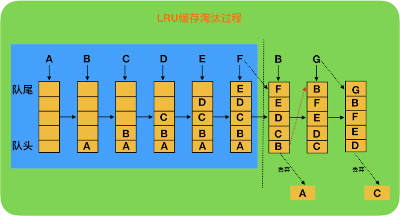

### 概述

>`LRU`(Least Recently Used)，即最近最少使用算法，它的核心思想是当缓存满时，会优先淘汰那些近期最少使用的缓存对象。
>
>该算法被应用在`LruCache`和`DiskLruCache`，分别用于实现内存缓存和磁盘缓存。

<!--more-->

### LruCache的介绍

> LruCache是个泛型类，主要算法原理是把最近使用的对象用强引用存储在`LinkedHashMap`中，当缓存满时，把最近最少使用的对象从内存中移除，并提供了get和put方法来完成缓存的获取和添加操作。

### LruCache的使用

```java
// 设置LruCache缓存的大小，一般为当前进程可用容量的1/8
int cacheSize = (int) (Runtime.getRuntime().totalMemory() / 8);

LruCache<String, Bitmap> mMemoryCache = new LruCache<String, Bitmap>(cacheSize) {

    // 重写sizeOf方法，计算出要缓存的每张图片的大小
    @Override
    protected int sizeOf(String key, Bitmap value) {
        return value.getByteCount();
    }
};
```

**NOTE**：缓存的总容量和每个缓存对象的大小所用的单位要一致。

### LruCache的实现原理

> LruCache的核心思想：维护一个缓存对象列表，其中对象列表的排列方式是按照访问顺序实现的，即一直没有访问的对象，将放在队头，最早被淘汰，而最近访问的对象将放在队尾，最晚被淘汰。



> LruCache的实现是使用LinkedHashMap来维护这个对象队列的。

```java
/**
 * @param  initialCapacity 初始化大小
 * @param  loadFactor      加载因子，用于当容量不足，自动扩大
 * @param  accessOrder     true访问顺序，false为插入顺序
 */
public LinkedHashMap(int initialCapacity, float loadFactor, boolean accessOrder) {
    super(initialCapacity, loadFactor);
    this.accessOrder = accessOrder;
}
```

LinkedHashMap使用示例：

```java
public class MainActivity extends AppCompatActivity {

    @Override
    protected void onCreate(Bundle savedInstanceState) {
        super.onCreate(savedInstanceState);
        setContentView(R.layout.activity_main);

        LinkedHashMap<String, String> map = new LinkedHashMap<>(0, 0.75f, true);
        map.put("A", "A");
        map.put("B", "B");
        map.put("C", "C");
        map.put("D", "D");
        map.put("E", "E");
        map.put("F", "F");

        map.get("A");
        map.get("B");

        for (Map.Entry<String, String> entry : map.entrySet()) {
            Log.i("TAG", "key:" + entry.getKey() + " value:" + entry.getValue());
        }
    }
}
```

运行结果：

```java
I/TAG: key:C value:C
I/TAG: key:D value:D
I/TAG: key:E value:E
I/TAG: key:F value:F
I/TAG: key:A value:A
I/TAG: key:B value:B
```

### LruCache的源码解析

#### 构造方法

```java
public LruCache(int maxSize) {
    if (maxSize <= 0) {
        throw new IllegalArgumentException("maxSize <= 0");
    }
    this.maxSize = maxSize;
    this.map = new LinkedHashMap<K, V>(0, 0.75f, true);
}
```

从构造方法可以看出，使用的是LinkedHashMap的访问顺序。

#### put()方法

```java
public final V put(K key, V value) {
    if (key == null || value == null) {
        throw new NullPointerException("key == null || value == null");
    }

    V previous;
    synchronized (this) {
        // 插入的缓存对象数加1
        putCount++;
        // 增加缓存对象的大小
        size += safeSizeOf(key, value);
        // 向map中加入缓存对象
        previous = map.put(key, value);
        // 如果有缓存对象，则缓存大小恢复到插入前
        if (previous != null) {
            size -= safeSizeOf(key, previous);
        }
    }

    // entryRemoved是空方法，可以自行实现
    if (previous != null) {
        // false表示调用的put()或remove
        // true表示因为内存不足，为了腾出空间
        entryRemoved(false, key, previous, value);
    }
	// 调整缓存大小
    trimToSize(maxSize);
    return previous;
}
```

#### trimToSize()方法

```java
public void trimToSize(int maxSize) {
    while (true) {
        K key;
        V value;
        synchronized (this) {
            if (size < 0 || (map.isEmpty() && size != 0)) {
                throw new IllegalStateException(getClass().getName() + ".sizeOf() is reporting inconsistent results!");
            }

            // 如果缓存大小size小于配置的最大缓存，则跳出循环
            if (size <= maxSize) {
                break;
            }
			// 获取最老的对象，即队头元素，近期最少访问的元素
            Map.Entry<K, V> toEvict = map.eldest();
            if (toEvict == null) {
                break;
            }

            key = toEvict.getKey();
            value = toEvict.getValue();
            // 删除最近最少使用的对象，并更新缓存的大小
            map.remove(key);
            size -= safeSizeOf(key, value);
            evictionCount++;
        }

        entryRemoved(true, key, value, null);
    }
}
```

#### get()方法

```java
public final V get(K key) {
    if (key == null) {
        throw new NullPointerException("key == null");
    }

    V mapValue;
    synchronized (this) {
        // 获取对应的缓存对象
        // get()方法会将访问的元素更新到队列的尾部
        mapValue = map.get(key);
        if (mapValue != null) {
            hitCount++;
            return mapValue;
        }
        missCount++;
    }

    // 不存在缓存对象，则创建，create方法是空方法，可以自行实现
    V createdValue = create(key);
    if (createdValue == null) {
        return null;
    }

    synchronized (this) {
        createCount++;
        // 将创建的对象放到缓存里
        mapValue = map.put(key, createdValue);

        // 如果缓存中存在该对象，则恢复缓存中的对象
        if (mapValue != null) {
            map.put(key, mapValue);
        } else {
            size += safeSizeOf(key, createdValue);
        }
    }

    if (mapValue != null) {
        entryRemoved(false, key, createdValue, mapValue);
        return mapValue;
    } else {
        trimToSize(maxSize);
        return createdValue;
    }
}
```

LinkedHashMap的get()方法：

```java
public V get(Object key) {
    Node<K,V> e;
    if ((e = getNode(hash(key), key)) == null)
        return null;
    if (accessOrder)
        // 重新排序该对象，将该对象放到队列尾部
        afterNodeAccess(e);
    return e.value;
}
```

afterNodeAccess()方法：

```java
void afterNodeAccess(Node<K,V> e) { // move node to last
    LinkedHashMapEntry<K,V> last;
    if (accessOrder && (last = tail) != e) {
        LinkedHashMapEntry<K,V> p =
            (LinkedHashMapEntry<K,V>)e, b = p.before, a = p.after;
        p.after = null;
        if (b == null)
            head = a;
        else
            b.after = a;
        if (a != null)
            a.before = b;
        else
            last = b;
        if (last == null)
            head = p;
        else {
            p.before = last;
            last.after = p;
        }
        tail = p;
        ++modCount;
    }
}
```

### 参考链接

1. [彻底解析Android缓存机制——LruCache](https://www.jianshu.com/p/b49a111147ee)
2. [LruCache 源码解析](https://github.com/LittleFriendsGroup/AndroidSdkSourceAnalysis/blob/master/article/LruCache%E6%BA%90%E7%A0%81%E8%A7%A3%E6%9E%90.md)
3. [Android源码解析——LruCache](https://blog.csdn.net/maosidiaoxian/article/details/51393753)