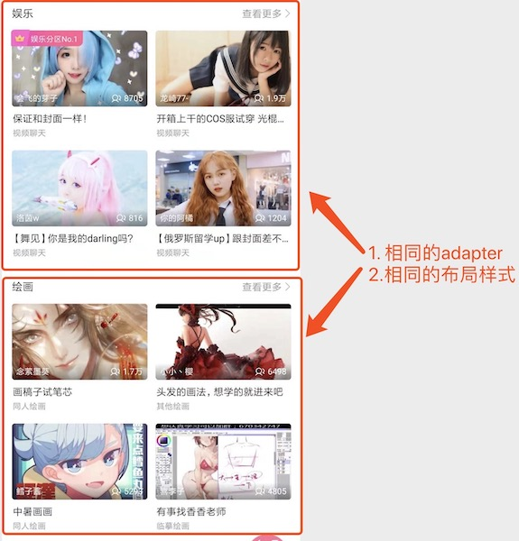

### 概述

>RecyclerView有着极高的灵活性，能实现ListView、GridView的所有功能。在日常开发中，使用非常广泛，如果使用不当将会影响到应用的整体性能，所以有必要了解一下如何更高效的使用。

<!--more-->

### 数据处理与视图绑定分离

> RecyclerView的`bindViewHolder`方法是在UI线程进行的，如果在该方法进行耗时操作，将会影响滑动的流畅性。

优化前：

```java
class Task {
    Date dateDue;
    String title;
    String description;

    // getters and setters here
}

class MyRecyclerView.Adapter extends RecyclerView.Adapter {

    static final TODAYS_DATE = new Date();
    static final DATE_FORMAT = new SimpleDateFormat("MM dd, yyyy");

    public onBindViewHolder(Task.ViewHolder tvh, int position) {
        Task task = getItem(position);

        if (TODAYS_DATE.compareTo(task.dateDue) > 0) {
            tvh.backgroundView.setColor(Color.GREEN);
        } else {
            tvh.backgroundView.setColor(Color.RED);
        }

        String dueDateFormatted = DATE_FORMAT.format(task.getDateDue());
        tvh.dateTextView.setDate(dueDateFormatted);
    }
}
```

上面的`onBindViewHolder`方法中进行了日期的比较和日期的格式化，这个是很耗时的，在`onBindViewHolder`方法中，应该只是将数据`set`到视图中，而不应进行业务的处理。

优化后：

```java
public class TaskViewModel {
    int overdueColor;
    String dateDue;
}

public onBindViewHolder(Task.ViewHolder tvh, int position) {
    TaskViewModel taskViewModel = getItem(position);
    tvh.backgroundView.setColor(taskViewModel.getOverdueColor());
    tvh.dateTextView.setDate(taskViewModel.getDateDue());
}
```

### 数据优化

> 1. 分页加载远端数据，对拉取的远端数据进行缓存，提高二次加载速度；
> 2. 对于新增或删除数据通过`DiffUtil`，来进行局部数据刷新，而不是一味的全局刷新数据。

`DiffUtil`是support包下新增的一个工具类，用来判断新数据和旧数据的差别，从而进行局部刷新。

DiffUtil的使用，在原来调用`mAdapter.notifyDataSetChanged() `的地方：

```java
// mAdapter.notifyDataSetChanged()
DiffUtil.DiffResult diffResult = DiffUtil.calculateDiff(new DiffCallBack(oldDatas, newDatas), true);
diffResult.dispatchUpdatesTo(mAdapter);
```

DiffUtil最终是调用Adapter的下面几个方法来进行局部刷新：

```java
mAdapter.notifyItemRangeInserted(position, count);
mAdapter.notifyItemRangeRemoved(position, count);
mAdapter.notifyItemMoved(fromPosition, toPosition);
mAdapter.notifyItemRangeChanged(position, count, payload);
```

### 布局优化

#### 减少过度绘制

> 减少布局层级，可以考虑使用自定义View来减少层级，或者更合理的设置布局来减少层级。

**Note**: 目前不推荐在RecyclerView中使用`ConstraintLayout`，在ConstraintLayout1.1.2版中，性能还是表现不佳，后续的版本可能这个问题就解决了，需要持续关注。

#### 减少xml文件inflate时间

> xml文件包括：layout、drawable的xml，xml文件inflate出ItemView是通过耗时的IO操作。可以使用代码去生成布局，即`new View()`的方式。这种方式是比较麻烦，但是在布局太过复杂，或对性能要求比较高的时候可以使用。

#### 减少View对象的创建

> 一个稍微复杂的 Item 会包含大量的 View，而大量的 View 的创建也会消耗大量时间，所以要尽可能简化 ItemView；设计 ItemType 时，对多 ViewType 能够共用的部分尽量设计成自定义 View，减少 View 的构造和嵌套。

#### 设置高度固定

> 如果item高度是固定的话，可以使用`RecyclerView.setHasFixedSize(true);`来避免requestLayout浪费资源。

### 共用RecycledViewPool

> 在嵌套RecyclerView中，如果子RecyclerView具有相同的adapter，那么可以设置`RecyclerView.setRecycledViewPool(pool)`来共用一个RecycledViewPool。

**Note**: 如果LayoutManager是LinearLayoutManager或其子类，需要手动开启这个特性：`layout.setRecycleChildrenOnDetach(true)`

```java
class OuterAdapter extends RecyclerView.Adapter<OuterAdapter.ViewHolder> {
    RecyclerView.RecycledViewPool mSharedPool = new RecyclerView.RecycledViewPool();

...

    @Override
    public OuterAdapter.ViewHolder onCreateViewHolder(ViewGroup parent, int viewType) {

        RecyclerView innerLLM = new RecyclerView(inflater.getContext());

        LinearLayoutManager innerLLM = new LinearLayoutManager(parent.getContext(), LinearLayoutManager.HORIZONTAL);
        innerLLM.setRecycleChildrenOnDetach(true);
        innerRv.setLayoutManager(innerLLM);
        innerRv.setRecycledViewPool(mSharedPool);
        return new OuterAdapter.ViewHolder(innerRv);
    }
```



### RecyclerView数据预取

> RecyclerView25.1.0及以上版本增加了`Prefetch`功能。
>
> 用于嵌套RecyclerView获取最佳性能。
>
> 详细分析：[RecyclerView 数据预取](https://juejin.im/entry/58a3f4f62f301e0069908d8f)

**Note**: 只适合横向嵌套

```java
// 在嵌套内部的LayoutManager中调用LinearLayoutManger的设置方法
// num的取值：如果列表刚刚展示4个半item，则设置为5
innerLLM.setInitialItemsPrefetchCount(num);
```

### 加大RecyclerView的缓存

>用空间换时间，来提高滚动的流畅性。

```java
recyclerView.setItemViewCacheSize(20);
recyclerView.setDrawingCacheEnabled(true);
recyclerView.setDrawingCacheQuality(View.DRAWING_CACHE_QUALITY_HIGH);
```

### 增加RecyclerView预留的额外空间

> 额外空间：显示范围之外，应该额外缓存的空间

```java
new LinearLayoutManager(this) {
    @Override
    protected int getExtraLayoutSpace(RecyclerView.State state) {
        return size;
    }
};
```

### 减少ItemView监听器的创建

> 对ItemView设置监听器，不要对每个item都创建一个监听器，而应该共用一个XxListener，然后根据`ID`来进行不同的操作，优化了对象的频繁创建带来的资源消耗。

### 优化滑动操作

> 设置`RecyclerView.addOnScrollListener();`来在滑动过程中停止加载的操作。

### 处理刷新闪烁

> 调用notifyDataSetChange时，适配器不知道整个数据集中的那些内容以及存在，再重新匹配ViewHolder时会花生闪烁。
>
> 设置adapter.setHasStableIds(true)，并重写getItemId()来给每个Item一个唯一的ID

### 回收资源

> 通过重写`RecyclerView.onViewRecycled(holder)`来回收资源。

### 参考链接

1. [RecyclerView 性能优化](https://blankj.com/2018/09/29/optimize-recycler-view/)
2. [Android recycleView 的一些优化与相关问题](https://blog.csdn.net/a8688555/article/details/79634295)
3. [RecyclerView Scrolling Performance](https://stackoverflow.com/questions/27188536/recyclerview-scrolling-performance)
4. [Optimizing RecyclerView/ListView](https://stackoverflow.com/questions/27993627/optimizing-recyclerview-listview)
5. [RecyclerView 列表类控件卡顿优化](http://www.cnblogs.com/ldq2016/p/9039979.html)
6. [RecyclerView 数据预取](https://juejin.im/entry/58a3f4f62f301e0069908d8f)
7. [DiffUtil新工具类，让你的RecyclerView飞一会](https://blog.csdn.net/qq_25867141/article/details/52769332)
8. [关于RecyclerView你知道的不知道的都在这了（上）](https://www.cnblogs.com/dasusu/p/9159904.html)
9. [关于RecyclerView你知道的不知道的都在这了（下）](https://www.cnblogs.com/dasusu/p/9255335.html)

