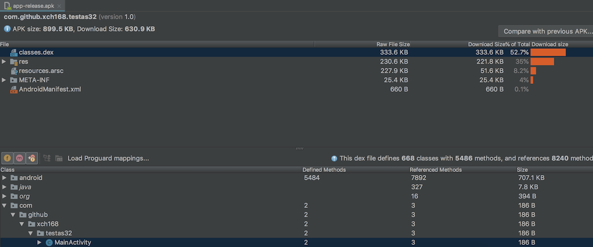
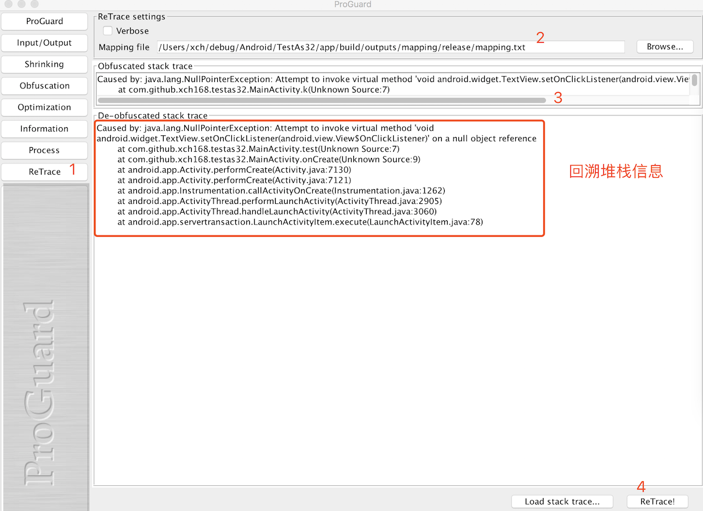

### 一、概述

> ProGuard 会检测和移除封装应用中未使用的类、字段、方法和属性，包括自带代码库中的未使用项（这使其成为以变通方式解决64k 引用限制的有用工具）。ProGuard 还可优化字节码，移除未使用的代码指令，以及用短名称混淆其余的类、字段和方法。混淆过的代码可令您的 APK 难以被逆向工程，这在应用使用许可验证等安全敏感性功能时特别有用。
<!-- more -->
### 二、开启混淆

在module的`build.gradle`文件中添加`minifyEnabled true`。由于代码混淆会导致构建速度变慢，所有不要在调试的构建中使用。

```gr
buildTypes {
        release {
            minifyEnabled true
            proguardFiles getDefaultProguardFile('proguard-android.txt'), 'proguard-rules.pro'
        }
    }
```

- `proguard-android.txt` :是系统默认的混淆规则配置文件，位置在 `<Android SDK目录>/tools/proguard`文件夹下。如果想进一步的压缩代码，可以使用位于相同目录下的`proguard-android-optimize.txt`文件，它还包含其他在字节码一级（方法内和方法间）执行分析的优化，以进一步减小APK大小和帮助提供运行速度。
- `prguard-rules.pro`在每个module中都有一个该文件，用于自定义对应module的ProGuard规则。

### 三、混淆规则

从系统的`proguard-android.txt`文件来学习混淆规则。

```properties
# This file is no longer maintained and is not used by new (2.2+) versions of the
# Android plugin for Gradle. Instead, the Android plugin for Gradle generates the
# default rules at build time and stores them in the build directory.
# SDK中的该文件已经不再维护，从Gradle2.2+版本后，gradle插件会自动生成这个默认配置文件，位置位于<项目根目录>/build/intermediates/proguard-files

# 混淆时不使用大小写混合，混淆后的类名为小写
-dontusemixedcaseclassnames

# 不跳过非公共的库的类
-dontskipnonpubliclibraryclasses

# 混淆后生成映射文件，map 类名->转化后类名的映射
-verbose

# Optimization is turned off by default. Dex does not like code run
# through the ProGuard optimize and preverify steps (and performs some
# of these optimizations on its own).
# 优化默认关闭，Dex不喜欢通过ProGuard的优化和预处理操作
-dontoptimize
-dontpreverify

# Note that if you want to enable optimization, you cannot just
# include optimization flags in your own project configuration file;
# instead you will need to point to the
# "proguard-android-optimize.txt" file instead of this one from your
# project.properties file.

# 保护代码中的Annotation不被混淆，这在JSON实体映射非常重要，如GSON
-keepattributes *Annotation*
-keep public class com.google.vending.licensing.ILicensingService
-keep public class com.android.vending.licensing.ILicensingService

# For native methods, see http://proguard.sourceforge.net/manual/examples.html#native
# 保留所有的地方native方法不被混淆
-keepclasseswithmembernames class * {
    native <methods>;
}

# keep setters in Views so that animations can still work.
# see http://proguard.sourceforge.net/manual/examples.html#beans
# 不混淆View中的setXxx()和getXxx()方法，以保证熟悉动画能正常工作
-keepclassmembers public class * extends android.view.View {
   void set*(***);
   *** get*();
}

# We want to keep methods in Activity that could be used in the XML attribute onClick
# 不混淆Activity中参数是View的方法，保证xml绑定的点击事件可以正常工作
-keepclassmembers class * extends android.app.Activity {
   public void *(android.view.View);
}

# For enumeration classes, see http://proguard.sourceforge.net/manual/examples.html#enumerations
# 不混淆枚举类中的value()和valueOf()方法
-keepclassmembers enum * {
    public static **[] values();
    public static ** valueOf(java.lang.String);
}

# 不混淆Parcelable实现类中的CREATOR字段，以保证Parcelable机制正常工作
-keepclassmembers class * implements android.os.Parcelable {
  public static final android.os.Parcelable$Creator CREATOR;
}

# 不混淆R文件中的所有静态字段，以保证正确找到每个资源id
-keepclassmembers class **.R$* {
    public static <fields>;
}

# The support library contains references to newer platform versions.
# Don't warn about those in case this app is linking against an older
# platform version.  We know about them, and they are safe.
# 不对android.support包下的代码警告。(如果打包的版本低于support包下某些类的使用版本，会出现警告)
-dontwarn android.support.**

# Understand the @Keep support annotation.
# 不混淆Keep类
-keep class android.support.annotation.Keep

# 不混淆使用了注解的类和类成员
-keep @android.support.annotation.Keep class * {*;}

# 如果类中有使用了注解的方法，则不混淆类和类成员
-keepclasseswithmembers class * {
    @android.support.annotation.Keep <methods>;
}

# 如果类中有使用了注解的字段，则不混淆类和类成员
-keepclasseswithmembers class * {
    @android.support.annotation.Keep <fields>;
}

# 如果类中有使用了注解的构造函数，则不混淆类和类成员
-keepclasseswithmembers class * {
    @android.support.annotation.Keep <init>(...);
}
```

#### keep类关键字

| 关键字                     | 含义                                                         |
| -------------------------- | ------------------------------------------------------------ |
| keep                       | 保留类和类成员，防止被混淆或移除                             |
| keepnames                  | 保留类和类成员，防止被混淆，但是没被引用的类成员会被移除     |
| keepclassmembers           | 只保留类成员，防止被混淆或移除                               |
| keepclassmembersnames      | 只保留类成员，防止被混淆，但没被引用的类成员会被移除         |
| keepclasseswithmembers     | 保留类和类成员，防止被混淆或移除，如果指定的类成员不存在还是会被混淆 |
| keepclasseswithmembernames | 保留类和类成员，防止被混淆，如果指定的类成员不存在还是会被混淆，没有被引用的类成员会被移除 |

#### 通配符

| 通配符    | 含义                                                         |
| --------- | ------------------------------------------------------------ |
| *         | 匹配任意长度字符，但不包含分隔符 “.”。例如一个类com.github.xch168.User，使用com.github.xch168.* 是可以匹配，但是com.github.* 不能匹配 |
| **        | 匹配任意长度字符，包括分隔符"."。如使用com.github.**,匹配包下的所有内容，可以匹配到com.github.xch168.User。 |
| ***       | 匹配任意参数类型。例如`*** getName(***)` 可匹配String getName(String) |
| ...       | 匹配任意长度的任意类型参数。例如void setName(…) 可以匹配void setName(String firstName, String secondName) |
| `<fileds>`  | 匹配类、接口中所有字段                                       |
| `<methods>` | 匹配类、接口中所有方法                                       |
| `<init>`    | 匹配类中所有构造函数                                         |

### 四、配置自己的混淆

- WebView中使用JS调用，需要添加如下配置：

```properties
-keepclassmembers class fqcn.of.javascript.interface.for.webview {
   public *;
}
```

- 不混淆某个特定的类和类中的所有成员

```properties
-keep class com.github.xch168.utils.CommonUtil { *; }
```

- 不混淆膜拜目录下的文件，例如使用Gson时，数据bean不能被混淆，需要添加如下配置：

```properties
-keep class com.github.xch168.model.** { *; }
```

- 保留泛型

```properties
-keepattributes Signature
```

- 保留用于调试堆栈跟中的行号信息

```properties
-keepattributes SourceFile,LineNumberTable
```

- 如果使用了上一行配置，还需要添加如下配置将源文件重命名为SourceFile，以便通过鼠标点击直达源文件：

```properties
-renamesourcefileattribute SourceFile
```

- 第三方库混淆案例

```properties
# Retrofit
# Retain generic type information for use by reflection by converters and adapters.
-keepattributes Signature
# Retain service method parameters.
-keepclassmembernames,allowobfuscation interface * {
    @retrofit2.http.* <methods>;
}
# Ignore annotation used for build tooling.
-dontwarn org.codehaus.mojo.animal_sniffer.IgnoreJRERequirement

# Okhttp
-dontwarn okhttp3.**
-dontwarn okio.**
-dontwarn javax.annotation.**
-dontwarn org.conscrypt.**
# A resource is loaded with a relative path so the package of this class must be preserved.
-keepnames class okhttp3.internal.publicsuffix.PublicSuffixDatabase
```

### 五、查看混淆结果

混淆打包后就会在`<module目录>/build/outputs/mapping/release`目录生成混淆的相关文件。

- `dump.txt`

  说明 APK 中所有类文件的内部结构。

- `mapping.txt`

  提供原始与混淆过的类、方法和字段名称之间的转换。

- `seeds.txt`

  列出未进行混淆的类和成员。

- `usage.txt`

  列出从 APK 移除的代码。

混淆后可以用Android Studio的`Analyze APK`工具对混淆后的apk包进行分析。



### 六、追溯Crash堆栈信息

混淆后的代码运行出错的堆栈信息如下，看不到具体的类名

```verilog
Caused by: java.lang.NullPointerException: Attempt to invoke virtual method 'void android.widget.TextView.setOnClickListener(android.view.View$OnClickListener)' on a null object reference
        at com.github.xch168.testas32.MainActivity.k(Unknown Source:7)
        at com.github.xch168.testas32.MainActivity.onCreate(Unknown Source:9)
        at android.app.Activity.performCreate(Activity.java:7130)
        at android.app.Activity.performCreate(Activity.java:7121)
        at android.app.Instrumentation.callActivityOnCreate(Instrumentation.java:1262)
        at android.app.ActivityThread.performLaunchActivity(ActivityThread.java:2905)
        at android.app.ActivityThread.handleLaunchActivity(ActivityThread.java:3060) 
        at android.app.servertransaction.LaunchActivityItem.execute(LaunchActivityItem.java:78)
```

为了解决这个问题，可以使用`<SDK目录>\tools\proguard\bin`下的**proguardgui.bat**脚本将Crash堆栈信息还原到混淆前的状态。步骤如下：

1. 运行`proguardgui.bat`脚本，然后点击`ReTrace`
2. 选择`mapping.txt`文件，位于`<module目录>/build/outputs/mapping/release`
3. 拷贝混淆后出错的堆栈信息
4. 点击右下角的ReTrace!按钮，完成Crash堆栈信息的追溯



### 七、压缩资源

> 资源压缩只与代码压缩协同工作。代码压缩器移除所有未使用的代码后，资源压缩器便可确定应用仍然使用的资源。这在您添加包含资源的代码库时体现得尤为明显 - 您必须移除未使用的库代码，使库资源变为未引用资源，才能通过资源压缩器将它们移除。

开启资源压缩：

在 `build.gradle` 文件中将 `shrinkResources` 属性设置为 `true`（在用于代码压缩的 `minifyEnabled` 旁边）

```groovy
android {
    ...
    buildTypes {
        release {
            shrinkResources true
            minifyEnabled true
            proguardFiles getDefaultProguardFile('proguard-android.txt'),
                    'proguard-rules.pro'
        }
    }
}
```

### 八、自定义要保留的资源

> 如果您有想要保留或舍弃的特定资源，请在您的项目中创建一个包含 `<resources>` 标记的 XML 文件，并在 `tools:keep` 属性中指定每个要保留的资源，在 `tools:discard` 属性中指定每个要舍弃的资源。这两个属性都接受逗号分隔的资源名称列表。您可以使用星号字符作为通配符。

```xml
<?xml version="1.0" encoding="utf-8"?>
<resources xmlns:tools="http://schemas.android.com/tools"
    tools:keep="@layout/l_used*_c,@layout/l_used_a,@layout/l_used_b*"
    tools:discard="@layout/unused2" />
```

将该文件保存在项目资源中，例如，保存在 `res/raw/keep.xml`。构建不会将该文件打包到 APK 之中。

### 九、总结

混淆后可以减小APK的大小，可以提高被反编译的难度，但是混淆后需要进行系统全面的测试。

### 参考链接

1. [压缩代码和资源](https://developer.android.com/studio/build/shrink-code?hl=zh-cn )
2. [Android 混淆查缺补漏](https://mp.weixin.qq.com/s?__biz=MzAxMTI4MTkwNQ==&mid=2650824879&idx=1&sn=f7d6830cb10046ff61bb461a15353e34&chksm=80b7b431b7c03d271d1d836b586a29f813d738d9b7774075f8b50e7ab0215052c3e075ab71c4&scene=38#wechat_redirect)
