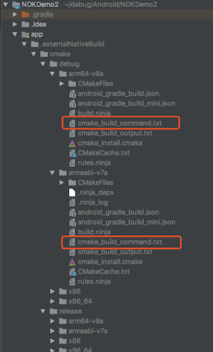

### 概述

> 在Android Studio 2.2及更高的版本，可以使用`CMake`将C/C++代码编译到一个native library（即.so文件），然后打包到APK中。

### 在Gradle中配置CMake变量

```groovy
android {
  ...
  defaultConfig {
    ...
    // 用于配置Cmake构建参数
    externalNativeBuild {
      cmake {
        ...
        // 将参数传递给变量时，请使用以下语法：
        // arguments "-DVAR_NAME=ARGUMENT".
        arguments "-DANDROID_ARM_NEON=TRUE",
        // 如果要将多个参数传递给变量, 使用以下语法一起传递:
        // arguments "-DVAR_NAME=ARG_1 ARG_2"
        // 下面一行将 'rtti' 和 'exceptions' 传递给 'ANDROID_CPP_FEATURES'.
                  "-DANDROID_CPP_FEATURES=rtti exceptions"
      }
    }
  }
  buildTypes {...}

  // 用于链接CMake脚本
  externalNativeBuild {
      cmake {
          path "CMakeLists.txt"
      }
  }
}
```

CMake部分构建变量列表：

| 变量名               | 参数                                                         | 描述                                        |
| -------------------- | ------------------------------------------------------------ | ------------------------------------------- |
| ANDROID_TOOLCHAIN    | clang(默认)                                                  | 指定CMake应该使用的编译器工具链             |
| ANDROID_PLATFORM     | android-19                                                   | 指定Android的目标平台                       |
| ANDROID_CPP_FEATURES | 默认为空，可配置：<br />rtti（RunTime Type Information）：运行时类型信息<br /> exceptions: 指示代码使用C++异常 | 指定CMake编译时需要使用某些C++特性          |
| ANDROID_ARM_MODE     | thumb（默认）<br />arm                                       | 指定是arm还是以thumb模式生成ARM目标二进制库 |

### CMake构建命令

Android Studio在`cmake_build_command.txt`文件中保存用于执行CMake构建的构建参数。

Android Studio会为每个ABI和每个构建类型创建`cmake_build_command.txt`，放置在如下目录：

> &lt;project-root&gt;/&lt;module-root&gt;/.externalNativeBuild/cmake/&lt;build-type&gt;/&lt;ABI&gt;/



示例：debug模式下的`armeabi-v7a`的CMake构建命令

```
Executable : /Users/xch/Library/Android/sdk/cmake/3.6.4111459/bin/cmake
arguments : 
-H/Users/xch/debug/Android/NDKDemo2/app
-B/Users/xch/debug/Android/NDKDemo2/app/.externalNativeBuild/cmake/debug/armeabi-v7a
-DANDROID_ABI=armeabi-v7a
-DANDROID_PLATFORM=android-19
-DCMAKE_LIBRARY_OUTPUT_DIRECTORY=/Users/xch/debug/Android/NDKDemo2/app/build/intermediates/cmake/debug/obj/armeabi-v7a
-DCMAKE_BUILD_TYPE=Debug
-DANDROID_NDK=/Users/xch/Library/Android/sdk/ndk-bundle
-DCMAKE_CXX_FLAGS=-frtti -fexceptions
-DCMAKE_TOOLCHAIN_FILE=/Users/xch/Library/Android/sdk/ndk-bundle/build/cmake/android.toolchain.cmake
-DCMAKE_MAKE_PROGRAM=/Users/xch/Library/Android/sdk/cmake/3.6.4111459/bin/ninja
-GAndroid Gradle - Ninja
jvmArgs : 
```

这些构建参数是Gradle插件基于`build.gradle`的配置自动生成。

CMake构建参数列表：

| 构建参数                                      | 描述                                                         |
| --------------------------------------------- | ------------------------------------------------------------ |
| -G  &lt;build-system&gt;                      | Android Gradle - Ninja是Android Studio唯一支持的C/C++构建系统.CMake会生成`android_gradle_build.json`文件。 其中包含有关CMake构建的Gradle插件的元数据，例如编译器标志和目标名称。 |
| -DANDROID_ABI &lt;abi&gt;                     | 目标ABI                                                      |
| -DCMAKE_LIBRARY_OUTPUT_DIRECTORY &lt;path&gt; | CMake生成的库的位置                                          |
| -DCMAKE_TOOLCHAIN_FILE &lt;path&gt;           | CMake用于交叉编译的`android.toolchain.cmake`文件的路径       |

### CMakeList.txt文件说明

```groovy
# 指定CMake编译器的最低版本
cmake_minimum_required(VERSION 3.4.1)

# 要求CMake根据指定的源文件生成库
add_library( # 生成的库的名称
             native-lib

             # 设置生成的库的类型
             SHARED

             # 所有需要加入到这个库的源文件
             src/main/cpp/native-lib.cpp )

# 如果需要使用系统预构建库，可以使用该方法来查找，比如这里的log库
find_library( # 该变量保存所要关联库的路径
              log-lib

              # 需要关联的库名称
              log )

# 指定需要关联的库
target_link_libraries( # 目标库文件
                       native-lib

                       # 需要在目标库文件中使用的库
                       ${log-lib} )
```

在上面使用`add_library`来添加系统的预构建库。如果要添加其他的非系统的预构建库，比较FFmpeg的相关库，需要按如下格式：

```groovy
# 添加第三方非系统预构建库
add_library( # 导入的库的名称
    		 imported-lib
            
             # 导入的库的类型
             SHARED
            
             # 表示是导入第三方库
             IMPORTED )

# 指定库的路径
set_target_properties( # 指定导入的库的名称
                       imported-lib

                       # Specifies the parameter you want to define.
                       PROPERTIES IMPORTED_LOCATION

                       # 指定要导入的库的路径
                       imported-lib/src/${ANDROID_ABI}/libimported-lib.so )

# 包含头文件的路径
include_directories( imported-lib/include/ ) 
```

如果要显示执行构建过程中的详细信息，比如为了得到更详细的出错信息。

```groovy
# 开启输出详细的编译和链接信息
set(CMAKE_VERBOSE_MAKEFILE on)

message("要打印的信息")
```

自定义变量

```groovy
set(变量名 变量值)
```

常用变量

```groovy
# 引用变量格式：${变量名}

# 工程的源文件目录
PROJECT_SOURCE_DIR 
# CMakeList.txt文件所在的目录
CMAKE_SOURCE_DIR
```

### 参考链接

1. [CMake](https://developer.android.com/ndk/guides/cmake)
2. [使用 CMake 进行 NDK 开发之如何编写 CMakeLists txt 脚本](https://juejin.im/post/5a30fa9b6fb9a0450167f43e)
3. [JNI和NDK编程-使用AndroidStudio进行NDK开发](https://blog.csdn.net/guiying712/article/details/75452193)
4. [Android NDK开发扫盲及最新CMake的编译使用](https://juejin.im/post/595da4e25188250d8b65ddbf)
5. [[cmake-commands](https://cmake.org/cmake/help/latest/manual/cmake-commands.7.html#id2)](https://cmake.org/cmake/help/latest/manual/cmake-commands.7.html)
6. [通过CMake来进行ndk开发之补充篇](https://blog.csdn.net/qq_34902522/article/details/78144127)

