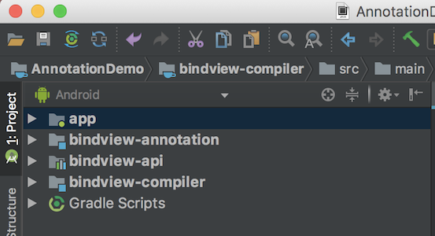
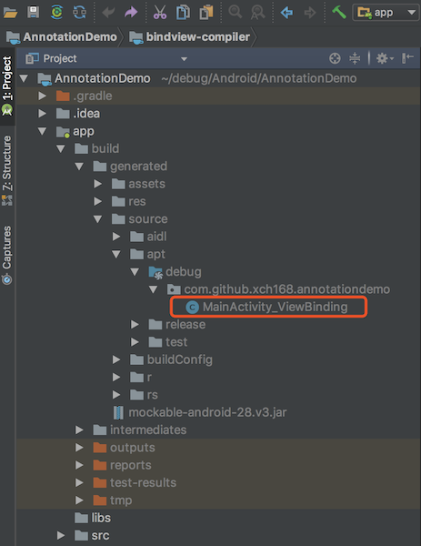

### 概述

> 注解处理器（Annotation Processor），是`javac`的一个工具，用来在编译时扫描和处理注解。
>
> 一个注解处理器以Java代码（或者编译过得字节码）作为输入，生成`.java`文件作为输出。

<!--more-->

接下来我们模仿[ButterKnife](https://github.com/JakeWharton/butterknife) 实现一个`@BindView`的注解来了解Java注解处理器的使用。

### 创建项目



**模块说明：**

`bindview-annotation`：定义注解，`@BindView`。
`bindview-compiler`：定义注解处理器，处理被`@BindView`标记的代码，并在编译时生成`xxxActivity_ViewBinding.java`
`bindview-api`：工具类，调用`xxxActivity_ViewBinding.java`中的方法，实现`View`的绑定。

### bindview-annotation(自定义注解)

创建注解类`BindView`

```java
@Retention(RetentionPolicy.CLASS)  // 表示编译时注解
@Target(ElementType.FIELD)         // 表示注解范围为类成员
public @interface BindView {
    int value();                   // 用于获取对应View的id
}
```

### bindview-compiler(注解处理器)

在该module的`build.gradle`中添加如下代码：

```groovy
dependencies {
    implementation 'com.google.auto.service:auto-service:1.0-rc3'
    implementation project(':bindview-annotation')
}
```

创建`BindViewProcessor`

```java
// 该注解用来自动生成META-INF/services/javax.annotation.processing.Processor文件，
// 并在该文件注册BindViewProcessor这个注解处理器
@AutoService(Processor.class)
public class BindViewProcessor extends AbstractProcessor {
    
    // 用来在处理注解的过程中打印日志
    private Messager mMessager;
    private Elements mElementUtils;
    private Map<String, ClassCreatorProxy> mProxyMap = new HashMap<>();

    @Override
    public synchronized void init(ProcessingEnvironment processingEnvironment) {
        super.init(processingEnvironment);

        mMessager = processingEnvironment.getMessager();
        mElementUtils = processingEnvironment.getElementUtils();
    }

    /**
     * 声明该注解所处理的注解类型，也可以直接在注解处理器的类声明添加如下注解：
     * @SupportedAnnotationTypes({"com.github.xch168.bindview.annotation.BindView"})
     * @return 接受处理的所有注解类型的集合
     */
    @Override
    public Set<String> getSupportedAnnotationTypes() {
        return Collections.singleton(BindView.class.getCanonicalName());
    }

    /**
     * 指定使用的Java版本
     * @return
     */
    @Override
    public SourceVersion getSupportedSourceVersion() {
        return SourceVersion.latestSupported();
    }

    @Override
    public boolean process(Set<? extends TypeElement> set, RoundEnvironment roundEnvironment) {
        mMessager.printMessage(Diagnostic.Kind.NOTE, "processing...");
        mProxyMap.clear();

        // 得到所有的注解
        Set<? extends Element> elements = roundEnvironment.getElementsAnnotatedWith(BindView.class);
        for (Element element : elements) {
            VariableElement variableElement = (VariableElement) element;
            TypeElement classElement = (TypeElement) variableElement.getEnclosingElement();
            String fullClassName = classElement.getQualifiedName().toString();
            ClassCreatorProxy proxy = mProxyMap.get(fullClassName);
            if (proxy == null) {
                proxy = new ClassCreatorProxy(mElementUtils, classElement);
                mProxyMap.put(fullClassName, proxy);
            }
            BindView bindAnnotation = variableElement.getAnnotation(BindView.class);
            int id = bindAnnotation.value();
            proxy.putElement(id, variableElement);
        }

        // 通过遍历mProxy，创建java文件
        for (String key : mProxyMap.keySet()) {
            ClassCreatorProxy proxyInfo = mProxyMap.get(key);
            mMessager.printMessage(Diagnostic.Kind.NOTE, " --> create " + proxyInfo.getProxyClassFullName());
            try {
                JavaFileObject jfo = processingEnv.getFiler().createSourceFile(proxyInfo.getProxyClassFullName(), proxyInfo.getTypeElement());
                Writer writer = jfo.openWriter();
                writer.write(proxyInfo.generateJavaCode());
                writer.flush();
                writer.close();
            } catch (IOException e) {
                e.printStackTrace();
                mMessager.printMessage(Diagnostic.Kind.NOTE, " --> create " + proxyInfo.getProxyClassFullName() + " error!");
            }
        }
        mMessager.printMessage(Diagnostic.Kind.NOTE, "process finish ...");
        return true;
    }
}
```

`ClassCreatorProxy`是创建Java代码的代理类：

```java
public class ClassCreatorProxy {

    private String mBindingClassName;
    private String mPackageName;
    private TypeElement mTypeElement;
    private Map<Integer, VariableElement> mVariableElementMap = new HashMap<>();

    public ClassCreatorProxy(Elements elementUtils, TypeElement classElement) {
        mTypeElement = classElement;
        PackageElement packageElement = elementUtils.getPackageOf(mTypeElement);
        String packageName = packageElement.getQualifiedName().toString();
        String className = mTypeElement.getSimpleName().toString();
        mPackageName = packageName;
        mBindingClassName = className + "_ViewBinding";
    }

    public void putElement(int id, VariableElement element) {
        mVariableElementMap.put(id, element);
    }

    public String generateJavaCode() {
        StringBuilder builder = new StringBuilder();
        builder.append("package ").append(mPackageName).append(";\n\n");
        builder.append("\n");
        builder.append("public class ").append(mBindingClassName);
        builder.append(" {\n");

        generateMethods(builder);

        builder.append("\n");
        builder.append("}\n");
        return builder.toString();
    }

    private void generateMethods(StringBuilder builder) {
        builder.append("public void bind(" + mTypeElement.getQualifiedName() + " host) {\n");
        for (int id : mVariableElementMap.keySet()) {
            VariableElement element = mVariableElementMap.get(id);
            String name = element.getSimpleName().toString();
            String type = element.asType().toString();
            builder.append("host." + name).append(" = ");
            builder.append("(" + type + ")(((android.app.Activity)host).findViewById(" + id + "));\n");
        }
        builder.append(" }\n");
    }

    public String getProxyClassFullName() {
        return mPackageName + "." + mBindingClassName;
    }

    public TypeElement getTypeElement() {
        return mTypeElement;
    }
}
```

### bindview-api(注解生成代码的调用工具类)

创建注解工具类`BindViewTool`

```groovy
public class BindViewTool {

    /**
     * 通过翻车找到对应的ViewBinding类，然后调用其中的bind方法，完成View的绑定
     * @param activity
     */
    public static void bind(Activity activity) {
        Class clz = activity.getClass();
        try {
            Class bindViewClass = Class.forName(clz.getName() + "_ViewBinding");
            Method method = bindViewClass.getMethod("bind", activity.getClass());
            method.invoke(bindViewClass.newInstance(), activity);
        } catch (ClassNotFoundException e) {
            e.printStackTrace();
        } catch (NoSuchMethodException e) {
            e.printStackTrace();
        } catch (IllegalAccessException e) {
            e.printStackTrace();
        } catch (InstantiationException e) {
            e.printStackTrace();
        } catch (InvocationTargetException e) {
            e.printStackTrace();
        }
    }
}
```

### 使用注解

在app模块的`build.gradle`中添加如下代码：

```groovy
dependencies {
    implementation project(':bindview-annotation')
    implementation project(':bindview-api')

    // Gradle 2.2及后面的版本都是用annotationProcessor，早先的版本是用apt，现以废弃，故不再介绍
    annotationProcessor project(':bindview-compiler')
}
```

在MainActivity中使用注解：

```java
public class MainActivity extends AppCompatActivity {

    @BindView(R.id.content)
    TextView mContentText;

    @Override
    protected void onCreate(Bundle savedInstanceState) {
        super.onCreate(savedInstanceState);
        setContentView(R.layout.activity_main);

        BindViewTool.bind(this);
        
        mContentText.setText("From BindView");
    }
}
```

运行后生成的代码（路径 `app/build/generated/source/apt`）：



`MainActivity_ViewBinding`代码：

```java
public class MainActivity_ViewBinding {
public void bind(com.github.xch168.annotationdemo.MainActivity host) {
	host.mContentText = (android.widget.TextView)(((android.app.Activity)host).findViewById(2131165228));
    }
}
```

### 通过javapoet生成代码

上面生成代码的部分，是通过字符串拼接，过程非常繁琐。接下来就介绍一种更优雅的方式，使用`javapoet`。

添加依赖：

```groovy
dependencies {
    implementation 'com.squareup:javapoet:1.10.0'
}
```

在`ClassCreatorProxy`中添加如下代码

```java
public class ClassCreatorProxy {
    // ……
  
    public TypeSpec generateJavaCodeByJavapoet() {
        TypeSpec bindingClass = TypeSpec.classBuilder(mBindingClassName)
                .addModifiers(Modifier.PUBLIC)
                .addMethod(generateMethodsByJavapoet())
                .build();
        return bindingClass;
    }

    private MethodSpec generateMethodsByJavapoet() {
        ClassName host = ClassName.bestGuess(mTypeElement.getQualifiedName().toString());
        MethodSpec.Builder methodBuilder = MethodSpec.methodBuilder("bind")
                .addModifiers(Modifier.PUBLIC)
                .returns(void.class)
                .addParameter(host, "host");

        for (int id : mVariableElementMap.keySet()) {
            VariableElement element = mVariableElementMap.get(id);
            String name = element.getSimpleName().toString();
            String type = element.asType().toString();
            methodBuilder.addCode("host." + name + " = " + "(" + type + ")(((android.app.Activity)host).findViewById(" + id + "));");
        }
        return methodBuilder.build();
    }

    public String getPackageName() {
        return mPackageName;
    }
}
```

在`BindViewProcessor`中调用：

```java
@Override
public boolean process(Set<? extends TypeElement> set, RoundEnvironment roundEnvironment) {
    // ...
    
    for (String key : mProxyMap.keySet()) {
        ClassCreatorProxy proxyInfo = mProxyMap.get(key);
        JavaFile javaFile = JavaFile.builder(proxyInfo.getPackageName(), proxyInfo.generateJavaCodeByJavapoet()).build();
        try {
            //　生成文件
            javaFile.writeTo(processingEnv.getFiler());
        } catch (IOException e) {
            e.printStackTrace();
        }
    }
    mMessager.printMessage(Diagnostic.Kind.NOTE, "process finish ...");
}
```

相比用StringBuilder拼Java代码，明显简介很多，且生成的代码是一样的。

### 参考文章

1. [【Android】APT](https://www.jianshu.com/p/7af58e8e3e18)
2. [自定义Java注解处理器](https://www.jianshu.com/p/50d95fbf635c)
3. [一小时搞明白注解处理器（Annotation Processor Tool）](https://blog.csdn.net/u013045971/article/details/53509237)
4. [Android APT及基于APT的简单应用](https://www.jianshu.com/p/94979c056b20)
5. [Android 编译时注解-提升-butterknife](https://blog.csdn.net/wzgiceman/article/details/54580745)
6. [javapoet](https://github.com/square/javapoet)