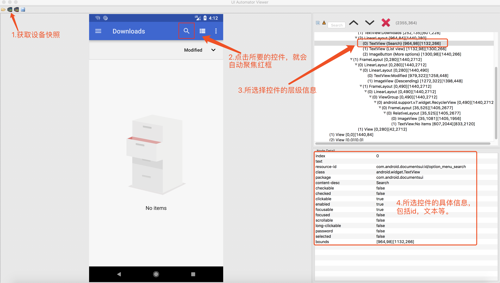
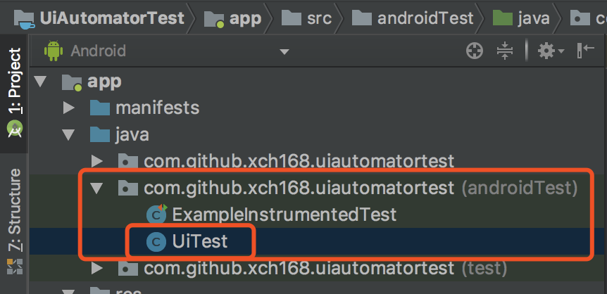
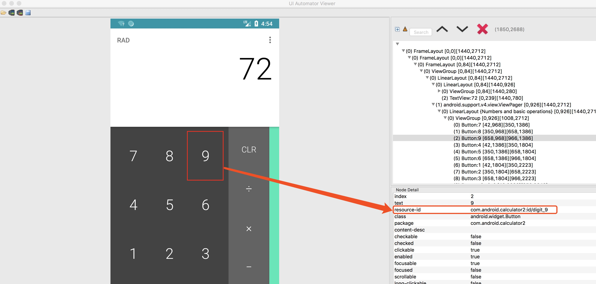
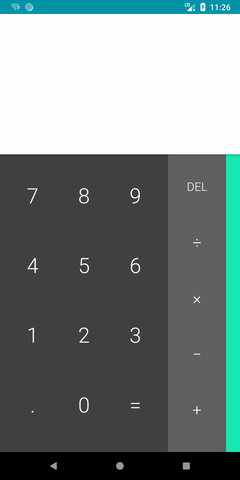

### 0x01 概述

UI Automator测试框架提供了一组API来构建UI测试，用于在用户应用和系统应用中执行交互。UI Automator测试框架非常适合编写黑盒自动化测试，其中的测试代码不依赖于目标应用的内部实现详情。

<!-- more -->
### 0x02 使用uiautomatorviewer工具获取Android应用的控件信息

> `uiautomatorviewer` 工具提供了方便的GUI，可以扫描和分析Android设备上当前显示的UI组件。您可以使用此工具检查布局层次结构，并查看在设备前台显示的UI组件属性。利用此信息，可以使用UI Automator创建控制更加精确的测试。

`uiautomatorviewer` 工具位于`<android-sdk>/tools/`目录中。



### 0x03 在Android项目中添加依赖

```groovy
androidTestImplementation 'com.android.support.test.uiautomator:uiautomator-v18:2.1.3'
```

### 0x04 创建单元测试类



### 0x05 创建测试用例

```java
// 使用JUnit4运行器
@RunWith(AndroidJUnit4.class)
public class UiTest {

    // Instrumentation可以在主程序启动之前，创建模拟的Context；发送UI事件给应用程序；
    // 检查程序当前运行状态；控制Android如何加载应用程序，控制应用程序和控件的生命周期;
    // 可以直接调用控件的方法，对控件的属性进行查看和修改
    private Instrumentation mInstrumentation;

    // 代表着Android设备
    private UiDevice mUiDevice;

    // 测试用例执行前，用于一些处理一些初始化工作
    @Before
    public void setUp() {
        mInstrumentation = InstrumentationRegistry.getInstrumentation();
        mUiDevice = UiDevice.getInstance(mInstrumentation);
    }

    // 一个测试用例
    @Test
    public void testAdd() {
        // 获取屏幕上计算器的数字"9"的控件，"com.android.calculator2:id/digit_9"为通过uiautomatoviewer工具获取的控件id
        UiObject2 digit9 = mUiDevice.findObject(By.res("com.android.calculator2:id/digit_9"));
        // 获取屏幕上计算器的数字"8"的控件
        UiObject2 digit8 = mUiDevice.findObject(By.res("com.android.calculator2:id/digit_8"));
        // 获取屏幕上计算器的"*"控件
        UiObject2 opMul = mUiDevice.findObject(By.res("com.android.calculator2:id/op_mul"));
        // 获取屏幕上计算器的"="的控件
        UiObject2 opEq = mUiDevice.findObject(By.res("com.android.calculator2:id/eq"));
        // 获取屏幕上计算器的结果显示控件
        UiObject2 result = mUiDevice.findObject(By.res("com.android.calculator2:id/result"));

        // 自动依序执行：
        // 1.点击计算器"9"控件
        // 2.点击计算器"*"控件
        // 3.点击计算器"8"控件
        // 4.点击计算器"="控件
        digit9.click();
        opMul.click();
        digit8.click();
        opEq.click();

        // 获取计算结果控件的值
        String resultValue = result.getText();

        // 进行断言判断，判断结果是否和预期一致
        Assert.assertEquals(72, Integer.parseInt(resultValue));
    }

    // 测试用例执行完后执行
    @After
    public void tearDown() {
    }
}
```



### 0x06 执行测试用例




### 0x07 相关API介绍

常见组件操作，类-UiObject2

| 功能 | 方法                                |
| ---- | ----------------------------------- |
| 点击 | public boolean click()              |
| 长按 | public boolean longClick()          |
| 拖动 | public void drag(Point dest)        |
| 输入 | public boolean setText(String text) |

常见设备操作，类-UiDevice

| 功能     | 方法                                                         |
| -------- | ------------------------------------------------------------ |
| 点击坐标 | public void click(int x, int y)                              |
| 按键     | public void pressKeyCode(int keyCode)                        |
| 滑动     | public boolean swipe(int startX, int startY,int endX,int endY,int steps)// 1个步长表示5ms |

### 0x08 其他用途

自动化是用于解放双手，将机械化的重复操作交由程序。UIAutomator可以用于进行重复的UI测试，也可以用于完成其他的类似转发链接给通讯录里的所有好友。


### 参考链接

1. [测试支持库](https://developer.android.com/topic/libraries/testing-support-library/#UIAutomator )
2. [Android白盒测试之Instrumentation初探（一）](https://blog.csdn.net/yiwachen/article/details/52464635)